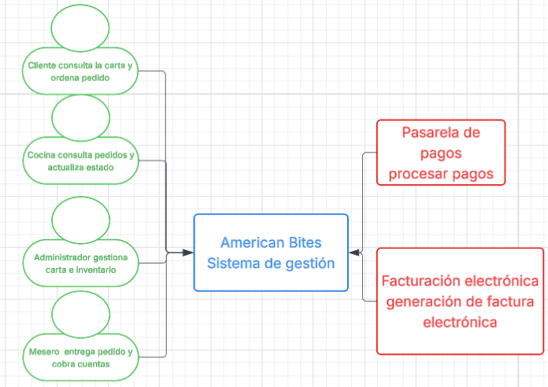

# Alcance del Sistema 
# American Bites

## Sistema

American Bites es un restaurante de comida rápida americana que busca
digitalizar la gestión de sus operaciones utilizando una plataforma que
permita administrar la carta, disponibilidad de productos, pedidos,
cocina, pagos, inventario y reportes de ventas. El sistema será utilizado
por clientes, meseros, personal de cocina y administradores.

## Problema a resolver

Actualmente, la operación del restaurante se realiza por comandas
en papel, llamadas a la cocina y una caja registradora aislada. Esto
dificulta la actualización de la disponibilidad de los productos, la
gestión de los pedidos, el control de ingredientes agotados y 
la generación de reportes de ventas.

## Diagrama de contexto

## Alcance del sistema

### Incluye

- Consulta de la carta y disponibilidad de productos.
- Creación y gestión de pedidos.
- Confirmación de pedidos y envío a cocina.
- Consulta y actualización del estado de los pedidos.
- Gestión de la carta.
- Gestión de inventario y disponibilidad de ingredientes.
- Gestión de cuentas y pagos.
- Generación de reportes de ventas.
- Control de acceso según el rol del usuario.
- Integración con la pasarela de pagos.
- Integración con el sistema de facturación electrónica.

### Fuera del alcance del MVP

- Servicio de domicilios.
- Reservas.
